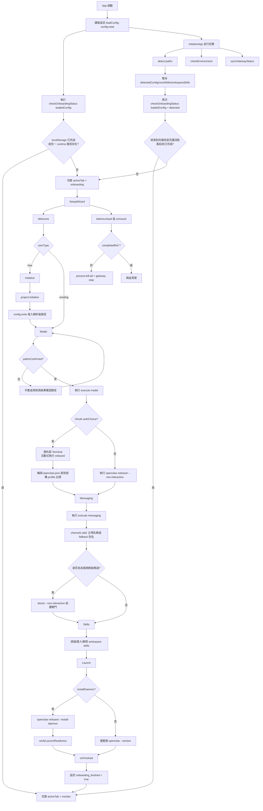

## Plan: Launch Pad 功能對齊 Control Center
將 NT-ClawLaunch Launch Pad 在不改 UI 風格與現有框架前提下，分階段補齊 control-center 等級的可觀測性、治理與資訊揭露能力。做法是沿用現有 Electron IPC + Zustand + 現有頁籤，先補資料面與 API 對接，再補高價值功能面板，最後補審計與運維工具。

**Steps**
1. 建立能力差距矩陣與資料契約（*先決步驟*）：定義 Launch Pad 現有 Monitor/Analytics/Settings/Onboarding 欄位，對照目標能力（健康、告警、審計、重播、任務、用量細分、安全揭露）。
2. 強化資料入口（*依賴 1*）：新增標準化 IPC 命令層（health、sessions、tasks、projects、audit、replay、usage），讓前端不再依賴單一檔案解析作為主來源。
3. 擴展 Store 領域模型（*依賴 2*）：在 Zustand 新增 health、alerts、notificationQueue、auditTimeline、replayIndex、taskHeartbeat、connectionStatus、securitySummary、memoryStatus，並加入 TTL 與 stale 標記。
4. Monitor 功能升級（*依賴 3*）：在現有 Monitor 頁中增設「健康總覽、異常隊列、任務心跳、連線狀態」四區塊，保留現有卡片風格與布局節奏。
5. Analytics 深化（*依賴 3；可與 4 並行*）：擴增維度到 agent/project/task/model/provider/sessionType，加入 context pressure、subscription 狀態、connector TODO 解釋。
6. Settings 可觀測化（*依賴 3；可與 4/5 並行*）：新增安全閘門摘要、風險等級、更新狀態、資料接線狀態，改為「可解釋系統狀態」而非純欄位編輯。
7. 任務與審批操作鏈補齊（*依賴 3*）：新增 task board 細節、DoD/artifact/rollback 顯示、approval 動作結果回寫與操作審計可見。
8. 審計與重播中心（*依賴 3*）：新增 timeline、severity filter、from/to 視窗、回放統計（returned/filtered）與導出。
9. Onboarding Launch 強化（*依賴 2/3*）：完成後顯示接線健康、降級項目與下一步，不只顯示「成功/部分失敗」。
10. 驗證與回歸（*依賴 4-9*）：補單元測試與手動驗證清單，確保 gateway 啟停、權限 gate、資料降級、UI 退化皆可預期。

**Relevant files**
- `frontend/src/App.tsx` — 現有 tab 結構與主流程入口，承接新功能分區最小改動點。
- `frontend/src/store.ts` — 擴展狀態模型與快照同步機制核心位置。
- `frontend/src/components/ActionCenter.tsx` — 審批/動作隊列升級入口。
- `frontend/src/components/Analytics.tsx` — 用量多維拆解與 budget/subscription 顯示主戰場。
- `frontend/src/components/StaffGrid.tsx` — 人員狀態與任務上下文交叉揭露入口。
- `frontend/src/components/MiniView.tsx` — 關鍵指標精簡視圖同步補強。
- `frontend/src/components/UpdateBanner.tsx` — 更新狀態/風險提示的現有承載區。
- `frontend/src/components/onboarding/SetupStepLaunch.jsx` — 啟動後健康診斷與降級說明落點。
- `frontend/electron/main.ts` — 新增 IPC 命令與後端數據彙整橋接層。
- `frontend/electron/preload.js` — 安全暴露 renderer API 的邊界層。

**Verification**
1. 功能驗證：每個頁籤至少有 1 個新增高價值資訊區塊，且可在真實資料缺失時顯示降級原因。
2. 數據驗證：比較前後快照欄位覆蓋率，確認新增 health/alerts/audit/replay/task-heartbeat/connector 狀態。
3. 安全驗證：受保護操作需明確 token/gate 狀態提示；失敗時顯示可行修復建議。
4. 體驗驗證：不改設計語言（排版節奏、卡片視覺、互動方式維持一致），僅擴充功能內容。
5. 回歸驗證：gateway start/stop、onboarding、analytics 既有流程不可退化。

**Decisions**
- 僅做功能面深化，不改主題、視覺語言、框架（React + Electron + Zustand）。
- 優先「資訊揭露完整度」與「可操作性」，其次才是新交互形式。
- 採增量式交付，先讓資料可見，再逐步補齊操作閉環。

**Further Considerations**
1. 資料來源策略：以 Gateway API 為主，日誌解析為備援。建議避免長期依賴單一 log 檔作為主資料源。
2. 性能策略：保留目前輪詢節奏，新增快取 TTL 與 in-flight 去重，避免 renderer 頻繁重算。
3. 風險策略：先做 read-only 觀測能力，再逐步開放 mutation 操作面，降低誤操作風險。

---

## Current Onboarding Flow (As-Is)
以下為目前前端實際執行中的導引流程，目的是把「現況」與上方優化目標分開。這不是理想流程，而是目前程式碼真的會怎麼跑。

### Entry Gate
- App 啟動時先讀取本地設定 `config:read`，再立刻判斷要顯示 Onboarding 還是 Monitor。
- 判斷條件非常寬鬆：只要 `localStorage.onboarding_finished === true`，或已儲存/偵測到任一條 `corePath`、`configPath`、`workspacePath`，就直接視為 onboarding 已完成。
- `detect:paths` 只會暫存偵測結果到 `detectedConfig`，不會直接覆寫 store.config；但它仍會影響 onboarding 是否被跳過。

### Mermaid Flow

### Step Responsibilities
1. Welcome
	決定 `userType` 是 `new` 或 `existing`。`new` 會清空目前設定與 `onboarding_finished`；`existing` 只預填偵測到的路徑，不直接帶入敏感授權資訊。
2. Initialize
	只在 `new` 模式出現。會呼叫 `project:initialize` 建立 Core / Config / Workspace，然後立即 `config:write`，避免後面被舊設定覆蓋。
3. Model
	先完成三區路徑確認，再做模型授權。OAuth 類型會開外部 Terminal 跑互動流程；API key / token 類型走非互動式 `openclaw onboard`。
4. Messaging
	呼叫 `openclaw channels add` 綁定通訊頻道，並對特定高風險群組頻道補跑 doctor 前置檢查。
5. Skills
	目前比較像工作區技能管理頁，不是純粹的「啟用技能」步驟。主要功能是掃描、匯入、刪除工作區技能。
6. Launch
	不是一律真的啟動 Gateway。若 `installDaemon=true` 才會安裝背景服務；否則只檢查 CLI 是否可用，真正啟動延後到 Dashboard。

### Runtime Cleanup Behavior
- Onboarding 尚未完成時，`SetupWizard` 在 `beforeunload` 或 unmount 會主動呼叫 `process:kill-all`，接著再嘗試執行 `openclaw gateway stop`。
- 只有 Launch 步驟完成並觸發 `onFinished` 後，才會透過 `completedRef` 停止這段清理邏輯。

### Current High-Impact Decision Points
1. `checkOnboardingStatus` 只看 path 是否存在，不看模型授權、頻道綁定或 launch readiness；這會讓「偵測到舊安裝」直接跳過導引。
2. `detect:paths` 雖然不直接覆寫 config，但會影響是否進 onboarding，因此它本質上仍是流程分流器。
3. `skills` 畫面與 `useOnboardingAction('skills')` 的語義沒有完全對齊；畫面偏管理，hook 偏啟用旗標。
4. `installDaemon=false` 時，Launch 步驟成功只代表 CLI 可執行，不代表 Gateway 已啟動。
5. onboarding 關閉時的 cleanup 仍依賴當前 config 組合 stop 指令，因此在多實例或舊路徑殘留場景下要特別小心。

### Optimization Implications
- 若要讓導引流程變得可預期，第一優先不是換 UI，而是把 onboarding completion 的判準改成「狀態完整度」而不是「任一路徑存在」。
- 若要保留既有安裝自動偵測，建議把它改成「候選方案」，而不是直接影響跳轉。
- `skills` 步驟應明確定義成「管理已安裝技能」或「選擇要啟用的能力」，目前兩種語義混在一起。
- `launch` 步驟需要明確區分「CLI ready」「daemon installed」「gateway running」三種狀態，否則使用者很容易把它們視為同一件事。
